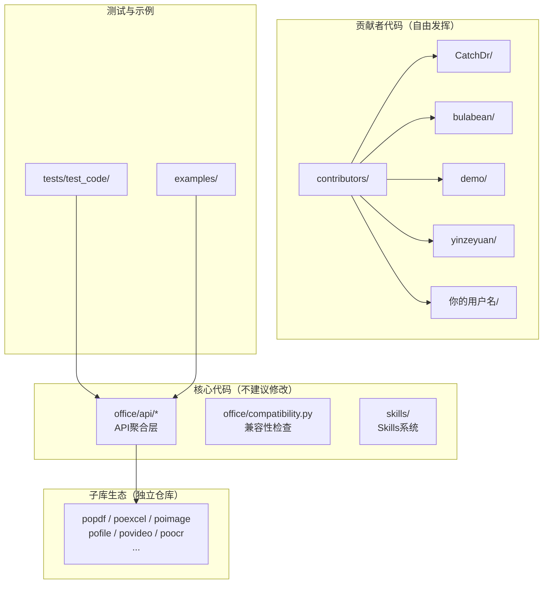
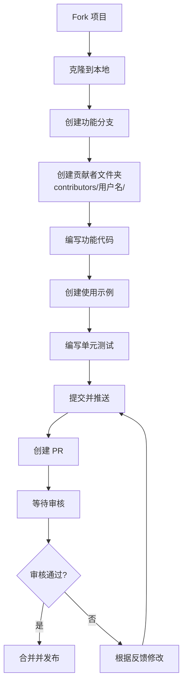
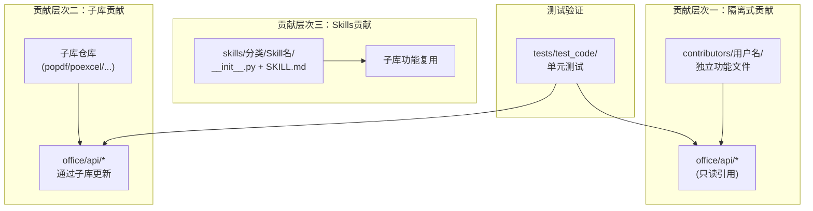
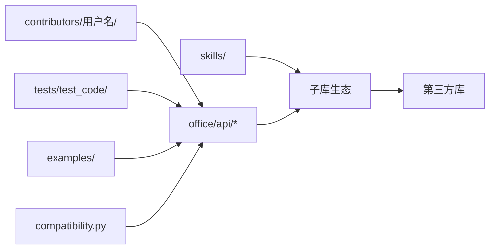

# 贡献代码指南

<cite>
**本文引用的文件**
- [README.md](file://README.md)
- [setup.cfg](file://setup.cfg)
- [setup.py](file://setup.py)
- [office/api/pdf.py](file://office/api/pdf.py)
- [office/api/excel.py](file://office/api/excel.py)
- [office/api/wechat.py](file://office/api/wechat.py)
- [office/compatibility.py](file://office/compatibility.py)
- [skills/README.md](file://skills/README.md)
- [contributors/demo/WordType.py](file://contributors/demo/WordType.py)
- [contributors/CatchDr/doc2docx.py](file://contributors/CatchDr/doc2docx.py)
- [contributors/bulabean/SearchExcel.py](file://contributors/bulabean/SearchExcel.py)
- [tests/test_code/test_pdf.py](file://tests/test_code/test_pdf.py)
- [tests/test_code/test_excel.py](file://tests/test_code/test_excel.py)
- [tests/test_code/test_optional_imports.py](file://tests/test_code/test_optional_imports.py)
</cite>

## 目录
1. [简介](#简介)
2. [项目结构与贡献模式](#项目结构与贡献模式)
3. [核心贡献流程](#核心贡献流程)
4. [架构总览](#架构总览)
5. [详细规范说明](#详细规范说明)
6. [依赖关系分析](#依赖关系分析)
7. [性能与质量建议](#性能与质量建议)
8. [故障排查指南](#故障排查指南)
9. [结语](#结语)

## 简介
本指南面向希望参与 python-office 项目开发的贡献者。与一般开源项目不同，python-office 采用独特的"隔离式贡献"模式：
- 所有贡献者必须在 `contributors/` 目录下创建独立文件夹，不修改核心代码。
- 同时欢迎通过子库生态（popdf、poexcel 等）贡献核心功能。
- 新增功能需配套使用示例和单元测试。

本指南依据仓库 README.md 的贡献要求，系统化说明从 fork 到 PR 提交的完整流程。

## 项目结构与贡献模式



**图表来源**
- [README.md](file://README.md#L1-L50)
- [contributors/](file://contributors/)

章节来源
- [README.md](file://README.md#L100-L135)

## 核心贡献流程

### 步骤 1：Fork 与克隆
```bash
# Fork 项目到个人仓库
git clone https://github.com/YOUR_USERNAME/python-office.git
cd python-office
git remote add upstream https://github.com/CoderWanFeng/python-office.git
```

### 步骤 2：创建贡献分支
```bash
git checkout -b feature-your-feature-name
```

### 步骤 3：创建贡献文件夹
```bash
# 在 contributors 目录下创建以 GitHub 用户名命名的文件夹
mkdir contributors/your-github-username
```

### 步骤 4：编写功能代码
在个人文件夹中创建功能文件，遵循代码规范（见下文）。

### 步骤 5：配套示例与测试
- 在 `examples/` 下创建使用示例
- 在 `tests/test_code/` 下编写单元测试

### 步骤 6：提交 PR
```bash
git add .
git commit -m "feat: 添加新功能描述"
git push origin feature-your-feature-name
# 在 GitHub/Gitee/atomgit 上创建 Pull Request
```



**图表来源**
- [README.md](file://README.md#L100-L135)

## 架构总览

python-office 的贡献架构分为三个层次：



**图表来源**
- [office/api/pdf.py](file://office/api/pdf.py#L1-L20)
- [contributors/demo/WordType.py](file://contributors/demo/WordType.py#L1-L20)
- [skills/README.md](file://skills/README.md#L1-L30)

## 详细规范说明

### 1) 隔离式贡献规范

每个贡献者在 `contributors/` 下创建独立文件夹，文件命名应清晰反映功能用途：

```
contributors/
├── CatchDr/
│   ├── Baidu_Text_transAPI.py
│   ├── doc2docx.py
│   └── docx2doc.py
├── bulabean/
│   ├── SearchExcel.py
│   └── SplitExcel.py
├── demo/
│   └── WordType.py
├── yinzeyuan/
│   ├── Rename-AddSomething.py
│   └── SearchSpecifyTypeFile.py
└── your-username/
    └── your-function.py
```

**核心原则：**
- **禁止修改他人代码**：严禁修改其他贡献者的代码或核心模块
- **禁止修改核心配置**：不修改 README.md、setup.cfg、setup.py 等
- **鼓励创新实验**：个人文件夹内可自由发挥

章节来源
- [README.md](file://README.md#L117-L135)
- [contributors/CatchDr/doc2docx.py](file://contributors/CatchDr/doc2docx.py#L1-L20)
- [contributors/bulabean/SearchExcel.py](file://contributors/bulabean/SearchExcel.py#L1-L20)

### 2) 代码规范

#### 文件头部注释
```python
# -*- coding: UTF-8 -*-
"""
功能描述：简要说明功能用途
作者：GitHub用户名
项目：https://www.python-office.com
"""
```

#### 函数文档字符串
```python
def your_function(param1: str, param2: int) -> bool:
    """功能简述。

    Args:
        param1 (str): 参数1说明
        param2 (int): 参数2说明

    Returns:
        bool: 返回值说明

    Raises:
        FileNotFoundError: 当文件不存在时抛出
    """
```

#### 命名规范
| 类型 | 规范 | 示例 |
|------|------|------|
| 函数/变量 | snake_case | `merge2pdf`, `input_file` |
| 类 | PascalCase | `CrossPlatformCompatibility` |
| 常量 | UPPER_CASE | `INPUT_PDF` |
| 文件名 | 功能导向 | `doc2docx.py`, `SearchExcel.py` |

#### 参数兼容规范（核心模块）
如需修改核心 API 参数名，必须保持向后兼容：
```python
# 旧参数名触发 DeprecationWarning，同时映射到新参数
def pdf2docx(input_file=None, output_file=None, file_path=None, ...):
    if file_path is not None:
        warnings.warn("'file_path' 已弃用，请使用 'input_file'", DeprecationWarning)
        input_file = input_file or file_path
```

章节来源
- [office/api/pdf.py](file://office/api/pdf.py#L1-L50)
- [contributors/demo/WordType.py](file://contributors/demo/WordType.py#L1-L20)

### 3) 延迟加载规范（Windows 专用模块）

对于依赖 Windows 专用库（poword、PyOfficeRobot 等）的 API 函数，必须在函数体内导入，而非模块顶部：

```python
# 正确：延迟加载
# office/api/wechat.py
def send_message(who, message):
    from PyOfficeRobot.XXBot import send_message as bot_send
    bot_send(who, message)

# 错误：顶部导入（非 Windows 系统会失败）
# from PyOfficeRobot.XXBot import send_message  # 不要这样写
```

章节来源
- [office/api/wechat.py](file://office/api/wechat.py#L1-L40)
- [tests/test_code/test_optional_imports.py](file://tests/test_code/test_optional_imports.py#L36-L58)

### 4) 创建使用示例

在 `examples/` 下选择合适子目录，新增 Python 文件：

```python
# examples/your_category/your_feature.py
"""
功能：演示 your_feature 的使用方法
"""
import office

# 示例1：基本用法
office.your_module.your_function(
    input_file='input.txt',
    output_file='output.txt'
)

# 示例2：批量用法
office.your_module.your_function(
    input_path='./input_dir/',
    output_path='./output_dir/'
)
```

章节来源
- [README.md](file://README.md#L80-L90)

### 5) 编写单元测试

在 `tests/test_code/` 下新增测试文件，使用 `unittest.TestCase`：

```python
# tests/test_code/test_your_feature.py
import unittest
from office.api.your_module import your_function
from tests.test_utils.comm_utils import file_exist

class TestYourFeature(unittest.TestCase):
    @classmethod
    def setUpClass(cls):
        cls.INPUT_FILE = './tests/test_files/your_module/input.txt'

    def test_your_function(self):
        """测试基本功能"""
        your_function(
            input_file=self.INPUT_FILE,
            output_file='./tests/test_files/your_module/output.txt'
        )
        # 验证输出文件存在
        self.assertTrue(file_exist('./tests/test_files/your_module/output.txt'))

    def test_your_function_batch(self):
        """测试批量处理"""
        your_function(
            input_path='./tests/test_files/your_module/',
            output_path='./tests/test_files/your_module/batch_output/'
        )
```

**测试覆盖要求：**
- 正常路径：单文件处理
- 批量路径：目录级批量处理
- 边界条件：空参数、非法路径
- 回归测试：历史兼容参数

章节来源
- [tests/test_code/test_pdf.py](file://tests/test_code/test_pdf.py#L1-L112)
- [tests/test_code/test_excel.py](file://tests/test_code/test_excel.py#L1-L81)

### 6) 添加新 Skill（可选）

如功能适合 AI 工具使用，可在 `skills/` 下创建 Skill：

```
skills/分类/your_skill/
├── __init__.py      # 功能实现（可复用子库）
└── SKILL.md         # AI可读文档
```

SKILL.md 格式：
```markdown
# Skill名称

## 功能描述
简要描述功能用途。

## 参数
| 参数名 | 类型 | 说明 |
|--------|------|------|
| input_file | str | 输入文件路径 |
| output_file | str | 输出文件路径 |

## 使用示例
\`\`\`python
from skills.分类.your_skill import your_function
your_function(input_file='input.pdf', output_file='output.pdf')
\`\`\`
```

章节来源
- [skills/README.md](file://skills/README.md#L1-L50)

## 依赖关系分析



- **贡献者代码**通过 `import office` 调用 API 层接口
- **测试代码**通过 `from office.api.* import *` 直接调用 API
- **示例代码**通过 `import office` 演示使用方法
- **Skills** 复用子库功能，可独立于 API 层

**图表来源**
- [office/api/pdf.py](file://office/api/pdf.py#L1-L20)
- [tests/test_code/test_pdf.py](file://tests/test_code/test_pdf.py#L1-L10)
- [skills/README.md](file://skills/README.md#L1-L30)

## 性能与质量建议
- 示例与测试应尽量覆盖常见输入规模与边界情况，避免长耗时任务阻塞 CI
- 测试文件中使用相对路径与固定测试资源，减少对环境的依赖
- 新增功能时，优先在 API 层增加参数校验与错误提示，提升用户体验
- Windows 专用功能必须使用延迟加载，确保跨平台导入安全
- 测试中可使用 `tests/test_utils/comm_utils.py` 中的工具函数，减少重复代码

## 故障排查指南
- **导入错误**：非 Windows 系统导入 wechat/word/ppt 模块时，检查是否使用了延迟加载
- **参数弃用警告**：旧参数名触发 `DeprecationWarning`，建议迁移到新参数名
- **测试路径问题**：确保测试文件路径使用 `./tests/test_files/` 前缀
- **首次运行标记**：如兼容性检查干扰测试，创建 `~/.python-office/first_run_mark` 文件跳过
- **子库版本不匹配**：部分功能对子库版本有最低要求，通过 `pip install --upgrade 子库名` 升级

章节来源
- [office/compatibility.py](file://office/compatibility.py#L185-L201)
- [office/api/pdf.py](file://office/api/pdf.py#L1-L50)
- [tests/test_code/test_optional_imports.py](file://tests/test_code/test_optional_imports.py#L68-L90)

## 结语
感谢每一位贡献者的付出。python-office 采用隔离式贡献模式，既保护核心代码稳定性，又为社区创新提供空间。请严格遵守新增/修改功能必须配套示例与测试的原则，共同维护 python-office 的高质量与易用性。如有任何疑问，欢迎在项目交流群中沟通。

| 平台 | 链接 | 适用场景 |
|------|------|---------|
| GitHub | https://github.com/CoderWanFeng/python-office/issues | 国际用户 |
| Gitee | https://gitee.com/CoderWanFeng/python-office/issues | 国内镜像 |
| atomgit | https://atomgit.com/CoderWanFeng1/python-office/issues | 国内首选 |
| 交流群 | https://www.python4office.cn/wechat-group | 技术交流 |
