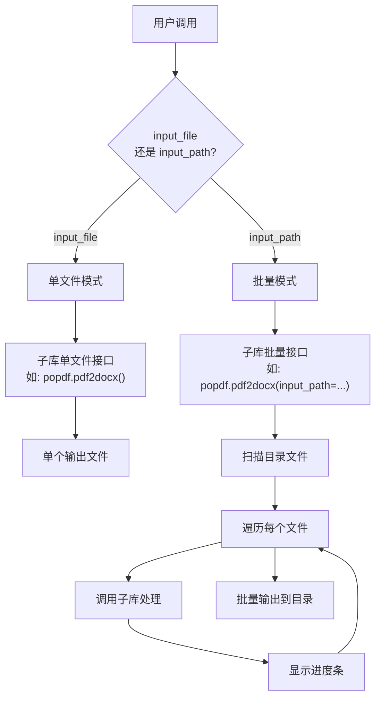
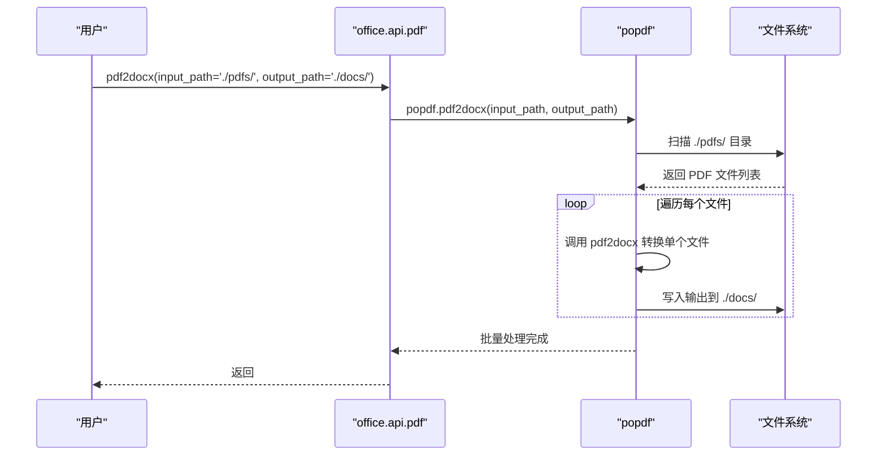

# 批量处理

<cite>
**本文引用的文件**
- [office/api/pdf.py](file://office/api/pdf.py)
- [office/api/excel.py](file://office/api/excel.py)
- [office/api/file.py](file://office/api/file.py)
- [office/api/image.py](file://office/api/image.py)
- [office/compatibility.py](file://office/compatibility.py)
- [setup.cfg](file://setup.cfg)
</cite>

## 目录
1. [简介](#简介)
2. [批量处理架构](#批量处理架构)
3. [PDF 批量处理](#pdf-批量处理)
4. [Excel 批量处理](#excel-批量处理)
5. [文件管理批量处理](#文件管理批量处理)
6. [图片批量处理](#图片批量处理)
7. [批量处理最佳实践](#批量处理最佳实践)
8. [故障排查](#故障排查)

## 简介
python-office 通过"单文件参数 + 目录参数"双模式设计，在同一个 API 函数中同时支持单文件和批量处理。用户只需将 `input_file` 替换为 `input_path`（目录路径），即可自动批量处理目录下所有匹配文件。

## 批量处理架构



**图表来源**
- [office/api/pdf.py](file://office/api/pdf.py#L48-L80)
- [office/api/excel.py](file://office/api/excel.py#L1-L30)

## PDF 批量处理

### 支持批量处理的 PDF 函数

| 函数 | 单文件参数 | 批量参数 | 说明 |
|------|-----------|---------|------|
| `pdf2docx` | `input_file`, `output_file` | `input_path`, `output_path` | PDF 转 Word |
| `encrypt4pdf` | `input_file`, `output_file` | `input_path`, `output_path` | PDF 加密 |
| `decrypt4pdf` | `input_file`, `output_file` | `input_path`, `output_path` | PDF 解密 |
| `pdf2imgs` | `input_file`, `output_file` | — | PDF 转图片 |
| `del4pdf` | `input_file`, `output_file` | `input_path`, `output_path` | 删除指定页 |

### 使用示例

#### 批量 PDF 转 Word
```python
import office

# 批量转换目录下所有 PDF 为 Word
office.pdf.pdf2docx(
    input_path='./pdf_files/',
    output_path='./word_output/'
)
```

#### 批量 PDF 加密
```python
import office

# 批量加密目录下所有 PDF
office.pdf.encrypt4pdf(
    input_path='./pdf_files/',
    output_path='./encrypted/',
    password='123456'
)
```

#### 批量 PDF 解密
```python
import office

# 批量解密目录下所有 PDF
office.pdf.decrypt4pdf(
    input_path='./encrypted/',
    output_path='./decrypted/',
    password='123456'
)
```

### 批量处理流程



**图表来源**
- [office/api/pdf.py](file://office/api/pdf.py#L48-L80)

## Excel 批量处理

### 支持批量处理的 Excel 函数

| 函数 | 参数 | 说明 |
|------|------|------|
| `merge2excel` | `dir_path`, `output_file` | 合并目录下所有 Excel 到一个文件 |
| `merge2sheet` | `dir_path` | 合并目录下所有 Excel 到同一个 Sheet |
| `sheet2excel` | `file_path` | 将 Excel 的多个 Sheet 拆分为独立文件 |
| `split_excel_by_column` | `filepath`, `column` | 按列值拆分 Excel |
| `find_excel_data` | `search_key`, `target_dir` | 在目录下搜索 Excel 数据 |

### 使用示例

#### 批量合并 Excel
```python
import office

# 合并目录下所有 Excel 文件
office.excel.merge2excel(
    dir_path='./excel_files/',
    output_file='merged.xlsx'
)
```

#### 按列拆分 Excel
```python
import office

# 按第6列的值拆分 Excel
office.excel.split_excel_by_column(
    filepath='data.xlsx',
    column=6
)
```

#### 批量搜索 Excel 数据
```python
import office

# 在目录下所有 Excel 中搜索关键词
office.excel.find_excel_data(
    search_key='程序员晚枫',
    target_dir='./excel_files/'
)
```

**图表来源**
- [office/api/excel.py](file://office/api/excel.py#L1-L80)

## 文件管理批量处理

### 支持批量处理的文件管理函数

| 函数 | 参数 | 说明 |
|------|------|------|
| `replace4filename` | `main_path`, `del_content`, `replace_content` | 批量替换文件名 |
| `get_files` | `path`, `file_type` | 获取目录下指定类型文件 |
| `file_name_add_prefix` | `file_path`, `prefix` | 批量添加前缀 |
| `file_name_add_postfix` | `file_path`, `postfix` | 批量添加后缀 |
| `search_by_content` | `search_content`, `search_dir` | 按内容搜索文件 |

### 使用示例

#### 批量重命名文件
```python
import office

# 将目录下所有文件名中的"副本"替换为"正式"
office.file.replace4filename(
    main_path='./files/',
    del_content='副本',
    replace_content='正式'
)
```

#### 获取目录下指定类型文件
```python
import office

# 获取目录下所有 PDF 文件
files = office.file.get_files(
    path='./documents/',
    file_type='pdf'
)
```

**图表来源**
- [office/api/file.py](file://office/api/file.py#L1-L50)

## 图片批量处理

### 支持批量处理的图片函数

| 函数 | 参数 | 说明 |
|------|------|------|
| `compress_image` | `input_file`, `output_file` | 图片压缩（需循环调用实现批量） |
| `add_watermark` | `input_file`, `mark_str`, `output_file` | 图片加水印 |
| `del_watermark` | `input_file`, `output_file` | 图片去水印 |

### 批量压缩图片示例
```python
import office
from office.api.file import get_files

# 批量压缩目录下所有图片
image_files = get_files(path='./images/', file_type='jpg')
for img in image_files:
    office.image.compress_image(
        input_file=f'./images/{img}',
        output_file=f'./compressed/{img}'
    )
```

**图表来源**
- [office/api/image.py](file://office/api/image.py#L1-L50)

## 批量处理最佳实践

### 1. 输出目录管理
```python
import os

# 批量处理前确保输出目录存在
output_dir = './output/'
os.makedirs(output_dir, exist_ok=True)
```

### 2. 错误处理
```python
import office
import logging

# 批量处理时捕获单个文件错误，不影响整体流程
try:
    office.pdf.pdf2docx(
        input_path='./pdfs/',
        output_path='./docs/'
    )
except Exception as e:
    logging.error(f"批量处理出错: {e}")
```

### 3. 进度监控
python-office 的子库内部使用 `poprogress` 显示进度条，用户无需额外处理：
```python
# 调用批量接口时自动显示进度条
office.pdf.encrypt4pdf(
    input_path='./pdfs/',
    output_path='./encrypted/',
    password='123456'
)
# 输出示例：
# [████████████████████████] 15/30 files (50%)
```

### 4. 内存管理
对于大文件批量处理，建议分批执行：
```python
import office
from office.api.file import get_files

# 分批处理大量文件
all_pdfs = get_files(path='./large_dir/', file_type='pdf')
batch_size = 50

for i in range(0, len(all_pdfs), batch_size):
    batch = all_pdfs[i:i+batch_size]
    for pdf in batch:
        try:
            office.pdf.pdf2docx(
                input_file=f'./large_dir/{pdf}',
                output_file=f'./output/{pdf.replace(".pdf", ".docx")}'
            )
        except Exception as e:
            print(f"处理 {pdf} 失败: {e}")
```

## 故障排查

| 问题 | 原因 | 解决方案 |
|------|------|---------|
| 批量处理只处理了部分文件 | 目录中包含非目标类型文件 | 使用 `get_files()` 预先筛选文件 |
| 输出目录不存在 | 子库未自动创建输出目录 | 提前 `os.makedirs(output_path, exist_ok=True)` |
| 内存不足 | 大文件批量处理占用过多内存 | 分批处理，每批 50-100 个文件 |
| 进度条不显示 | 终端不支持或 poprogress 未安装 | `pip install poprogress` |
| 权限错误 | 输出目录无写入权限 | 检查目录权限，使用 `chmod` 修改 |
| 跨平台问题 | Windows 专用模块在非 Windows 系统 | 检查兼容性提示，使用替代方案 |

**图表来源**
- [office/compatibility.py](file://office/compatibility.py#L40-L72)
- [setup.cfg](file://setup.cfg#L19-L41)
