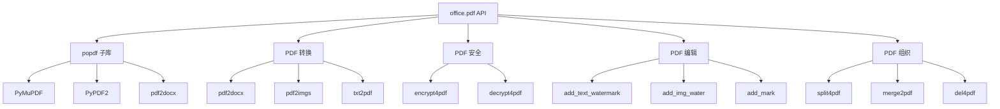
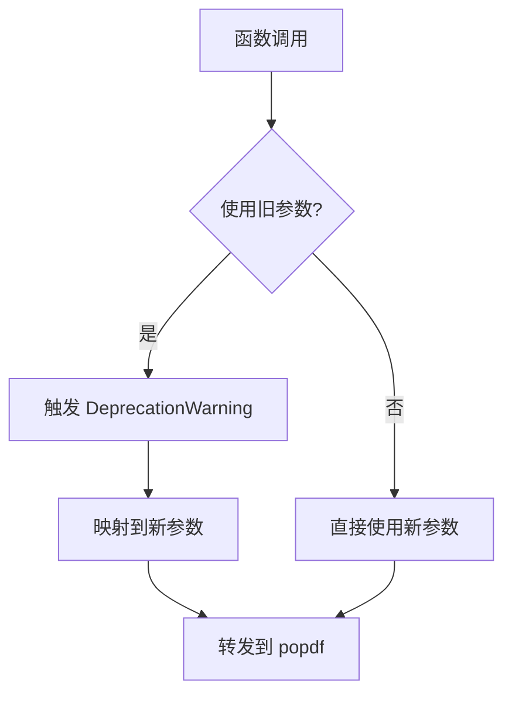

# PDF 处理

<cite>
**本文档中引用的文件**
- [office/api/pdf.py](file://office/api/pdf.py)
- [examples/popdf/pdf转word.py](file://examples/popdf/pdf转word.py)
- [examples/popdf/pdf转图片.py](file://examples/popdf/pdf转图片.py)
- [examples/popdf/PDF加密.py](file://examples/popdf/PDF加密.py)
- [examples/popdf/PDF解密.py](file://examples/popdf/PDF解密.py)
- [examples/popdf/合并PDF.py](file://examples/popdf/合并PDF.py)
- [examples/popdf/TXT转PDF.py](file://examples/popdf/TXT转PDF.py)
- [examples/popdf/PDF加水印.py](file://examples/popdf/PDF加水印.py)
</cite>

## 目录
1. [简介](#简介)
2. [功能架构](#功能架构)
3. [PDF 转换功能](#pdf-转换功能)
4. [PDF 安全功能](#pdf-安全功能)
5. [PDF 编辑功能](#pdf-编辑功能)
6. [PDF 组织功能](#pdf-组织功能)
7. [参数兼容机制](#参数兼容机制)

## 简介

python-office 的 PDF 处理模块（`office.pdf`）基于 popdf 库，提供 13 个功能，覆盖 PDF 转 Word、PDF 转图片、文本转 PDF、PDF 拆分、加密/解密、添加水印、合并、删除页面等常见操作。

## 功能架构



## PDF 转换功能

### PDF 转 Word
将 PDF 转换为 .docx 文件，底层基于 pdf2docx 库。

```python
import office
office.pdf.pdf2docx(input_file='report.pdf', output_file='report.docx')
```

### PDF 转图片
将 PDF 每页转换为图片，支持合并为一张长图。

```python
# 分页模式
office.pdf.pdf2imgs(input_file='report.pdf', output_file='./images/')

# 合并模式
office.pdf.pdf2imgs(input_file='report.pdf', output_file='output.jpg', merge=True)
```

### 文本转 PDF
将 .txt 文件转换为 PDF 格式。

```python
office.pdf.txt2pdf(input_file='notes.txt', output_file='notes.pdf')
```

## PDF 安全功能

### PDF 加密
为 PDF 文件设置密码保护。

```python
office.pdf.encrypt4pdf(password='123456', input_file='doc.pdf', output_file='encrypted.pdf')
```

### PDF 解密
移除 PDF 密码保护。

```python
office.pdf.decrypt4pdf(password='123456', input_file='encrypted.pdf', output_file='decrypted.pdf')
```

## PDF 编辑功能

### 添加文本水印
在 PDF 指定位置添加文本水印。

```python
office.pdf.add_text_watermark(
    input_file='doc.pdf',
    point=(100, 100),
    text='机密文件',
    output_file='watermarked.pdf',
    fontsize=24,
    color=(0.5, 0.5, 0.5)
)
```

### 添加图片水印
给 PDF 添加图片水印。

```python
office.pdf.add_img_water(
    input_file='doc.pdf',
    mark_file='logo.png',
    output_file='watermarked.pdf'
)
```

### 参数化添加水印
通过参数方式添加水印到 PDF。

```python
office.pdf.add_watermark_by_parameters(
    input_file='doc.pdf',
    mark_str='python-office',
    output_path='./output/',
    output_file='watermarked.pdf'
)
```

## PDF 组织功能

### PDF 拆分
按页码范围提取 PDF 内容。

```python
office.pdf.split4pdf(input_file='book.pdf', output_file='chapter1.pdf', from_page=1, to_page=10)
```

### 合并 PDF
将多个 PDF 文件合并为一个。

```python
office.pdf.merge2pdf(
    input_file_list=['file1.pdf', 'file2.pdf', 'file3.pdf'],
    output_file='merged.pdf'
)
```

### 删除页面
从 PDF 中删除指定页码的页面。

```python
office.pdf.del4pdf(input_file='doc.pdf', output_file='cleaned.pdf', page_nums=[2, 4])
```

## 参数兼容机制

python-office 的 PDF 模块支持新旧参数名共存，旧参数会触发 `DeprecationWarning`：



| 新参数 | 旧参数（已弃用） | 函数 |
|--------|-----------------|------|
| `input_file` | `file_path` / `pdf_path` | pdf2docx / pdf2imgs |
| `output_file` | `output` / `output_file_name` | merge2pdf / add_mark |
| `input_file` | `pdf_file_in` | add_img_water |
| `mark_file` | `pdf_file_mark` | add_img_water |

**Section sources**
- [office/api/pdf.py](file://office/api/pdf.py#L1-L434)
