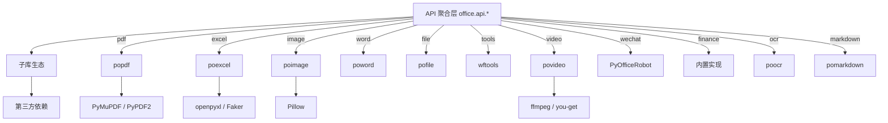
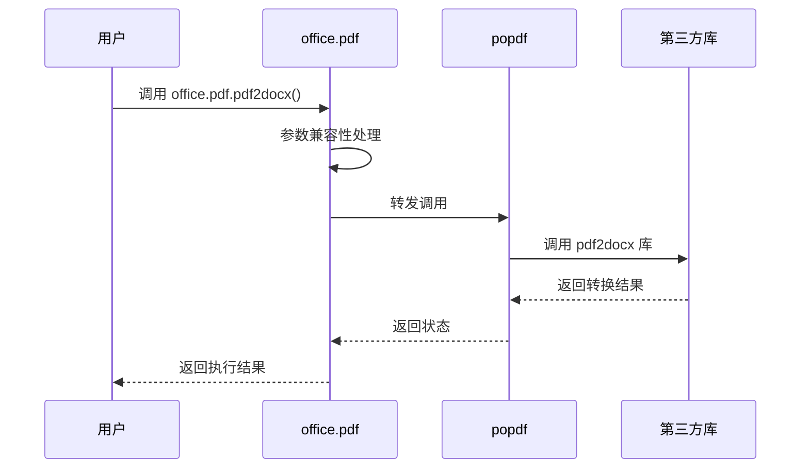

# 核心功能详解

<cite>
**本文档中引用的文件**
- [office/api/pdf.py](file://office/api/pdf.py)
- [office/api/excel.py](file://office/api/excel.py)
- [office/api/image.py](file://office/api/image.py)
- [office/api/word.py](file://office/api/word.py)
- [office/api/file.py](file://office/api/file.py)
- [office/api/tools.py](file://office/api/tools.py)
- [office/api/video.py](file://office/api/video.py)
- [office/api/wechat.py](file://office/api/wechat.py)
- [office/api/finance.py](file://office/api/finance.py)
- [office/api/ocr.py](file://office/api/ocr.py)
- [office/api/markdown.py](file://office/api/markdown.py)
</cite>

## 目录
1. [简介](#简介)
2. [功能架构](#功能架构)
3. [PDF 处理功能](#pdf-处理功能)
4. [Excel 处理功能](#excel-处理功能)
5. [图片处理功能](#图片处理功能)
6. [Word 处理功能](#word-处理功能)
7. [文件管理功能](#文件管理功能)
8. [视频处理功能](#视频处理功能)
9. [微信自动化功能](#微信自动化功能)
10. [工具类功能](#工具类功能)
11. [金融计算功能](#金融计算功能)
12. [最佳实践建议](#最佳实践建议)

## 简介

python-office 是一个专为 Python 自动化办公设计的多功能聚合库，覆盖 PDF、Excel、图片、Word、PPT、视频、微信、文件管理、工具类、金融计算、OCR、Markdown 等 13 个分类、73 个功能。通过简洁的 API 设计，用户可以轻松实现各种办公自动化任务。

## 功能架构

python-office 采用"API 聚合层 → 子库 → 第三方依赖"的分层架构。API 聚合层提供用户友好的函数接口，子库负责具体功能实现，第三方依赖提供底层能力。

**Diagram sources**
- [office/__init__.py](file://office/__init__.py#L1-L30)
- [setup.cfg](file://setup.cfg#L21-L41)

## PDF 处理功能

python-office 的 PDF 处理模块（`office.pdf`）基于 popdf 库，提供 13 个功能：

| 功能 | 函数名 | 说明 |
|------|--------|------|
| PDF 转 Word | `pdf2docx` | 将 PDF 转换为 .docx 文件 |
| PDF 转图片 | `pdf2imgs` | 将 PDF 每页转换为图片，支持合并为一张 |
| 文本转 PDF | `txt2pdf` | 将 .txt 文件转换为 PDF |
| PDF 拆分 | `split4pdf` | 按页码范围提取 PDF 内容 |
| PDF 加密 | `encrypt4pdf` | 为 PDF 设置密码保护 |
| PDF 解密 | `decrypt4pdf` | 移除 PDF 密码保护 |
| 添加文本水印 | `add_text_watermark` | 在 PDF 指定位置添加文本水印 |
| 合并 PDF | `merge2pdf` | 将多个 PDF 合并为一个文件 |
| 删除页面 | `del4pdf` | 删除 PDF 中指定页码的页面 |
| 添加图片水印 | `add_img_water` | 给 PDF 添加图片水印 |
| 添加水印（参数化）| `add_watermark_by_parameters` | 参数化方式添加水印 |
| 添加水印（交互）| `add_mark` | 添加水印到 PDF |

**Section sources**
- [office/api/pdf.py](file://office/api/pdf.py#L1-L434)

## Excel 处理功能

Excel 处理模块（`office.excel`）基于 poexcel 库，提供 7 个功能：

| 功能 | 函数名 | 说明 |
|------|--------|------|
| 模拟数据 | `fake2excel` | 自动创建 Excel 并填充模拟数据 |
| 合并到不同 Sheet | `merge2excel` | 多个 Excel 合并到一个文件的不同 sheet |
| Sheet 拆分 | `sheet2excel` | 同一 Excel 不同 sheet 拆分为不同文件 |
| 合并到同一 Sheet | `merge2sheet` | 多个 Excel 的多个 sheet 自动合并 |
| 内容搜索 | `find_excel_data` | 搜索 Excel 中指定内容 |
| 按列拆分 | `split_excel_by_column` | 按指定列的内容拆分 Excel |
| Excel 转 PDF | `excel2pdf` | 将 Excel 工作表转换为 PDF |

**Section sources**
- [office/api/excel.py](file://office/api/excel.py#L1-L163)

## 图片处理功能

图片处理模块（`office.image`）基于 poimage 库，提供 9 个功能：

| 功能 | 函数名 | 说明 |
|------|--------|------|
| 图片压缩 | `compress_image` | 压缩图片，减小文件大小 |
| 图片加水印 | `add_watermark` | 给图片添加文本水印 |
| 图片去水印 | `del_watermark` | 去除图片水印 |
| 生成词云 | `txt2wordcloud` | 根据文本生成词云图 |
| 铅笔画风格 | `pencil4img` | 将图片转换为铅笔画风格 |
| 卡通风格 | `img2Cartoon` | 将图片转换为卡通风格 |
| 下载图片 | `down4img` | 从 URL 下载图片 |
| 解析二维码 | `decode_qrcode` | 解析二维码图片内容 |
| 图片转 GIF | `image2gif` | 将图片转换为 GIF 格式 |

**Section sources**
- [office/api/image.py](file://office/api/image.py#L1-L202)

## Word 处理功能

Word 处理模块（`office.word`）基于 poword 库，提供 5 个功能（仅 Windows）：

| 功能 | 函数名 | 说明 |
|------|--------|------|
| Word 转 PDF | `docx2pdf` | 将 Word 文档转换为 PDF |
| 合并 Word | `merge4docx` | 合并多个 Docx 文件 |
| Doc 转 Docx | `doc2docx` | 将 .doc 转换为 .docx |
| Docx 转 Doc | `docx2doc` | 将 .docx 转换为 .doc |
| 提取图片 | `docx4imgs` | 从 Word 文档中提取图片 |

**Section sources**
- [office/api/word.py](file://office/api/word.py#L1-L119)

## 文件管理功能

文件管理模块（`office.file`）基于 pofile 库，提供 9 个功能：

| 功能 | 函数名 | 说明 |
|------|--------|------|
| 批量重命名 | `replace4filename` | 批量修改文件/文件夹名称 |
| 插入字符 | `file_name_insert_content` | 在文件名中间插入字符 |
| 添加前缀 | `file_name_add_prefix` | 给文件名添加前缀 |
| 添加后缀 | `file_name_add_postfix` | 给文件名添加后缀 |
| 整理到 Excel | `output_file_list_to_excel` | 将文件名整理到 Excel |
| 搜索文件 | `search_specify_type_file` | 搜索指定类型文件 |
| 按名分组 | `group_by_name` | 按名称分组整理文件 |
| 获取文件列表 | `get_files` | 搜索指定类型文件并返回列表 |
| 按类型添加行 | `add_line_by_type` | 根据文件类型添加行内容 |

**Section sources**
- [office/api/file.py](file://office/api/file.py#L1-L198)

## 视频处理功能

视频处理模块（`office.video`）基于 povideo 库，提供 4 个功能：

| 功能 | 函数名 | 说明 |
|------|--------|------|
| 视频转 MP3 | `video2mp3` | 从视频中提取音频 |
| 音频转文字 | `audio2txt` | 从音频中提取文字（语音识别） |
| 视频加水印 | `mark2video` | 给视频添加水印 |
| 文本转语音 | `txt2mp3` | 将文本转换为语音 MP3 |

**Section sources**
- [office/api/video.py](file://office/api/video.py#L1-L98)

## 微信自动化功能

微信自动化模块（`office.wechat`）基于 PyOfficeRobot 库，提供 7 个功能（仅 Windows）：

| 功能 | 函数名 | 说明 |
|------|--------|------|
| 发送消息 | `send_message` | 发送消息给指定联系人 |
| 定时发送 | `send_message_by_time` | 在指定时间发送消息 |
| 关键词聊天 | `chat_by_keywords` | 根据关键词自动聊天 |
| 发送文件 | `send_file` | 发送文件给指定联系人 |
| 群发消息 | `group_send` | 群发消息 |
| 接收消息 | `receive_message` | 接收微信消息并保存 |
| 智能聊天 | `chat_robot` | 智能聊天机器人 |

**Section sources**
- [office/api/wechat.py](file://office/api/wechat.py#L1-L145)

## 工具类功能

工具类模块（`office.tools`）基于 wftools 库，提供 10 个功能：

| 功能 | 函数名 | 说明 |
|------|--------|------|
| 翻译 | `transtools` | 多语言翻译 |
| 生成二维码 | `qrcodetools` | 生成二维码图片 |
| 生成密码 | `passwordtools` | 生成指定长度密码 |
| 天气查询 | `weather` | 获取当前天气信息 |
| URL 转 IP | `url2ip` | 将 URL 转换为 IP 地址 |
| 生成彩票 | `lottery8ticket` | 生成 8 位彩票号码 |
| 创建文章 | `create_article` | 自动创建文章 |
| WiFi 密码 | `pwd4wifi` | 生成 WiFi 密码列表 |
| 网速测试 | `net_speed_test` | 测试网络速度 |
| 课程信息 | `course` | 显示课程信息与资源链接 |

**Section sources**
- [office/api/tools.py](file://office/api/tools.py#L1-L195)

## 金融计算功能

金融计算模块（`office.finance`）内置实现，提供股票 T+0 交易收益计算：

| 功能 | 函数名 | 说明 |
|------|--------|------|
| T+0 收益计算 | `t0` | 计算做 T 的收益（含手续费、印花税） |

该模块使用 Python 内置 `decimal` 模块进行精确计算，考虑买入佣金、卖出佣金和印花税。

**Section sources**
- [office/api/finance.py](file://office/api/finance.py#L1-L51)

## 最佳实践建议

1. **路径处理**：始终使用绝对路径或确保相对路径正确
2. **跨平台注意**：Word、PPT、微信功能仅 Windows 可用，首次运行查看兼容性提示
3. **参数兼容**：使用新参数名，旧参数会触发弃用警告
4. **按需安装**：只需特定功能时安装对应子库，减少依赖体积
5. **Skills 系统**：优先使用 Skills 方式导入，便于 AI 工具识别
6. **错误处理**：关注函数日志输出，使用 loguru 记录的问题信息
7. **批量操作**：合理设置输出目录，避免文件覆盖

**Section sources**
- [office/compatibility.py](file://office/compatibility.py#L40-L72)
- [README.md](file://README.md#L56-L100)
