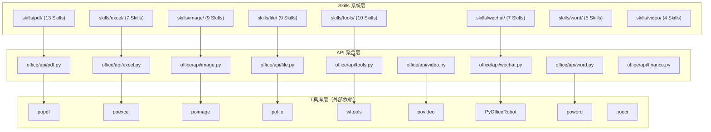
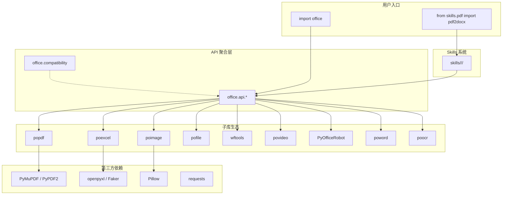
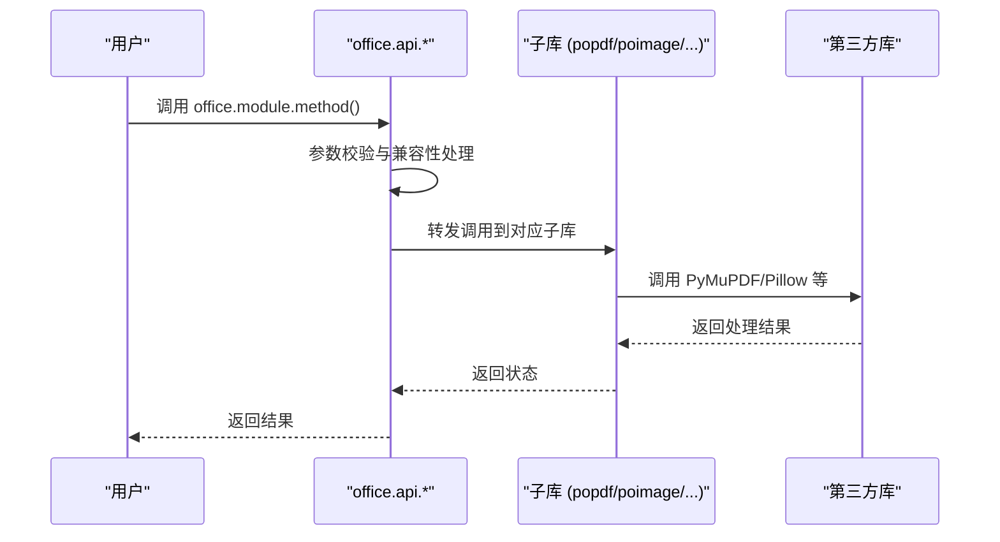
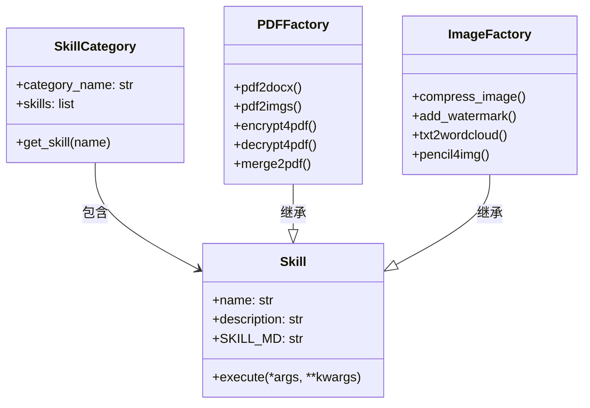
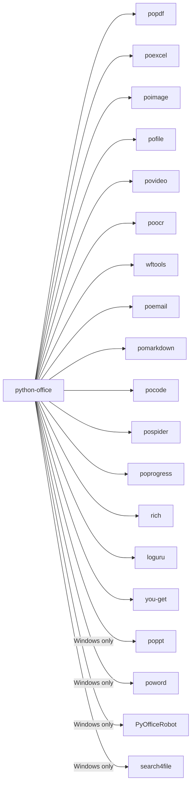

# 项目概述

<cite>
**本文引用的文件**
- [README.md](file://README.md)
- [setup.cfg](file://setup.cfg)
- [setup.py](file://setup.py)
- [office/__init__.py](file://office/__init__.py)
- [office/compatibility.py](file://office/compatibility.py)
- [office/api/pdf.py](file://office/api/pdf.py)
- [office/api/excel.py](file://office/api/excel.py)
- [office/api/image.py](file://office/api/image.py)
- [office/api/tools.py](file://office/api/tools.py)
- [office/api/file.py](file://office/api/file.py)
- [office/api/wechat.py](file://office/api/wechat.py)
- [office/api/word.py](file://office/api/word.py)
- [office/api/video.py](file://office/api/video.py)
- [office/api/finance.py](file://office/api/finance.py)
- [skills/README.md](file://skills/README.md)
</cite>

## 目录
1. [简介](#简介)
2. [项目结构](#项目结构)
3. [核心组件](#核心组件)
4. [架构总览](#架构总览)
5. [详细组件分析](#详细组件分析)
6. [依赖关系分析](#依赖关系分析)
7. [性能与可用性考量](#性能与可用性考量)
8. [故障排查指南](#故障排查指南)
9. [结论](#结论)
10. [附录](#附录)

## 简介

python-office 是中文世界最受欢迎的 Python 办公自动化聚合库，一个库覆盖 90% 的办公场景：PDF/Word/Excel/PPT 转换、图片处理、视频音频、微信机器人、邮件发送、文件管理、OCR 识别、AI 工具等。项目自 2020 年持续维护，累计下载量 40 万+，GitHub Star 1200+，MIT 开源协议。

- 官方网站：[python-office.com](https://www.python-office.com/)
- 中文文档：[python4office.cn](https://www.python4office.cn/python-office/profile/)
- 社区交流：README 提供官方微信群二维码与多平台链接
- 核心理念：零 Python 基础也能用，每个功能只需一行代码

项目内置 **Skills 系统**：将 73 个方法封装为 73 个独立可导入的 Skill，每个 Skill 配有 `SKILL.md` 文档，可被 Codex / Claude / Cursor 等 AI 工具自动识别调用。

**章节来源**
- file://README.md#L1-L70

## 项目结构

项目采用"API 聚合层 + Skills 系统层 + 工具库层"的三层组织方式：

- **API 聚合层**（`office/api/`）：对外暴露统一的函数接口，将请求转发给底层子库（popdf、poimage、poexcel 等）
- **Skills 系统层**（`skills/`）：将每个方法封装为独立 Skill，支持单独导入和 AI 自动识别
- **工具库层**：通过依赖独立的子库（popdf、poimage、povideo、poocr 等）实现具体功能
- **兼容性层**（`office/compatibility.py`）：跨平台兼容性检查，首次运行提示
- **GUI 与示例**：提供桌面 GUI 和丰富的使用示例

**图表来源**
- [office/__init__.py](file://office/__init__.py#L1-L30)
- [setup.cfg](file://setup.cfg#L19-L41)
- [skills/README.md](file://skills/README.md#L1-L274)

**章节来源**
- file://README.md#L56-L100
- file://setup.cfg#L19-L41

## 核心组件

- **API 聚合层**：提供统一的 `office.module.method()` 调用方式，13 个模块覆盖 PDF、Excel、图片、Word、PPT、视频、微信、文件、工具、金融、OCR、Markdown、邮件
- **Skills 系统**：73 个独立可导入的 Skill，每个 Skill 对应一个 `SKILL.md` 文档，支持 AI 工具自动识别
- **兼容性检查器**：`office/compatibility.py` 中的 `CrossPlatformCompatibility` 类，在非 Windows 系统首次运行时提示功能兼容性
- **子库生态**：popdf、poimage、poexcel、pofile、povideo、poocr、wftools、poword、poppt、PyOfficeRobot、poemail、pomarkdown、pocode、pospider、poprogress、pohan、potime、search4file

**章节来源**
- file://office/__init__.py#L1-L30
- file://office/compatibility.py#L1-L250
- file://skills/README.md#L1-L274

## 架构总览

python-office 的整体架构遵循"聚合层 → 子库 → 第三方依赖"的分层设计：

- API 聚合层作为统一门面，将用户请求转发给对应的子库
- Skills 系统层为 API 层的薄封装，提供独立导入和 AI 识别能力
- 子库负责具体功能实现，封装第三方库调用
- 兼容性检查器在模块导入时自动执行，提供跨平台提示

**图表来源**
- [office/__init__.py](file://office/__init__.py#L1-L30)
- [setup.cfg](file://setup.cfg#L19-L41)

## 详细组件分析

### API 聚合层：统一门面接口
- 13 个模块文件，每个模块对应一个功能类别
- 统一调用方式：`office.module.method()`
- 参数兼容：支持新旧参数名共存，旧参数触发 DeprecationWarning
- 延迟导入：Windows 专用模块（poword、PyOfficeRobot）采用延迟加载，在非 Windows 环境下不报错

**章节来源**
- file://office/api/pdf.py#L1-L434
- file://office/api/image.py#L1-L202

### Skills 系统层：AI 友好的独立 Skill
- 73 个 Skill 分布在 13 个分类目录下
- 每个 Skill 是一个独立子目录，包含 `__init__.py` 和 `SKILL.md`
- 支持三种导入方式：`from skills.xxx import yyy`、`from office.skills.xxx import yyy`、`import office; office.xxx.yyy()`
- `SKILL.md` 遵循标准格式，包含触发条件、参数说明、使用示例

**章节来源**
- file://skills/README.md#L1-L274

### 兼容性检查器：跨平台支持
- 首次运行检测：通过标记文件 `~/.python-office/first_run_mark` 判断是否首次运行
- 平台识别：自动识别 Windows、macOS、Linux
- 功能兼容性分类：完全支持 / 仅 Windows 支持两类
- 替代方案建议：为非 Windows 用户提供 LibreOffice 等替代方案

**章节来源**
- file://office/compatibility.py#L1-L250

### GUI 与示例
- GUI：提供基于 PySide6/PyQt 的桌面应用（PDF 转 Word 工具、Fluent Gallery），位于 `gui/` 目录
- 示例：`examples/` 目录按子库名分类，提供每个功能的使用示例

**章节来源**
- file://README.md#L56-L100

## 依赖关系分析

- **核心子库**：popdf、poexcel、poimage、pofile、povideo、poocr、wftools、poemail、pomarkdown、pocode、pospider、poprogress
- **Windows 专用子库**：poppt、poword、search4file、PyOfficeRobot（通过 `platform_system=='Windows'` 条件安装）
- **通用依赖**：rich（彩色输出）、loguru（日志）、you-get（视频下载）
- Python 版本要求：>=3.6

**图表来源**
- [setup.cfg](file://setup.cfg#L19-L41)

**章节来源**
- file://setup.cfg#L19-L41

## 性能与可用性考量

- **轻量化安装**：用户可只安装需要的子库（如 `pip install popdf`），避免全量安装的依赖膨胀
- **延迟导入**：Windows 专用模块采用延迟加载策略，避免在非 Windows 环境下导入失败
- **参数兼容**：新旧参数名共存，旧参数触发 DeprecationWarning，确保向后兼容
- **跨平台提示**：首次运行自动提示功能兼容性，帮助用户了解平台限制
- **AI 友好**：Skills 系统使 AI 工具能自动识别并调用正确的方法

[本节为通用指导，无需特定文件来源]

## 故障排查指南

- **导入失败**：检查 Python 版本是否 >=3.6，子库是否已安装
- **Windows 专用功能不可用**：poword、poppt、PyOfficeRobot 仅在 Windows 上可用，macOS/Linux 用户请查看兼容性提示
- **参数弃用警告**：使用旧参数名会触发 DeprecationWarning，建议迁移到新参数名
- **依赖冲突**：使用虚拟环境隔离依赖，或只安装需要的子库
- **微信机器人无法运行**：确保 Windows 环境、桌面微信已登录、PyOfficeRobot 已安装

**章节来源**
- file://office/compatibility.py#L1-L250
- file://office/api/wechat.py#L1-L30

## 结论

python-office 以聚合层 + Skills 系统的双层设计，为 Python 自动化办公提供了覆盖面最广的一站式解决方案。通过统一的 `import office` 入口，用户可以一行代码完成 PDF 转换、图片压缩、Excel 合并、微信发消息等 73 种常见办公任务。Skills 系统进一步使每个功能可被 AI 工具自动识别调用，代表了办公自动化库的 AI 化方向。

**章节来源**
- file://README.md#L1-L70

## 附录
- 安装与使用：README 提供 pip 安装与子库独立安装说明
- 功能清单：README 列举了 13 个分类、73 个 Skill 的完整索引
- 社区与贡献：README 提供 issue 与 PR 流程说明，contributors 目录存放贡献者代码
- Skills 索引：[skills/README.md](file://skills/README.md) 提供完整的 Skill 分类与调用示例

**章节来源**
- file://README.md#L56-L100
- file://skills/README.md#L1-L274
